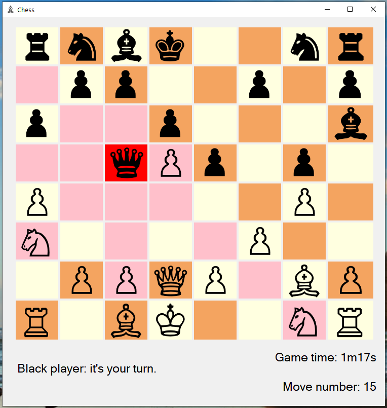
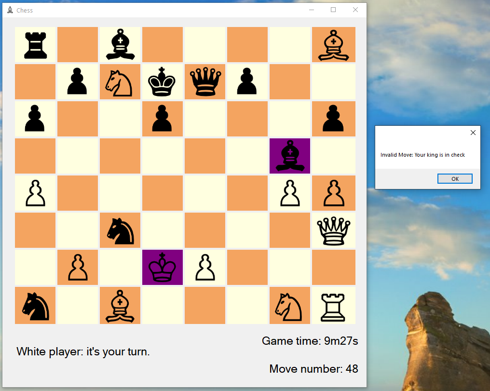
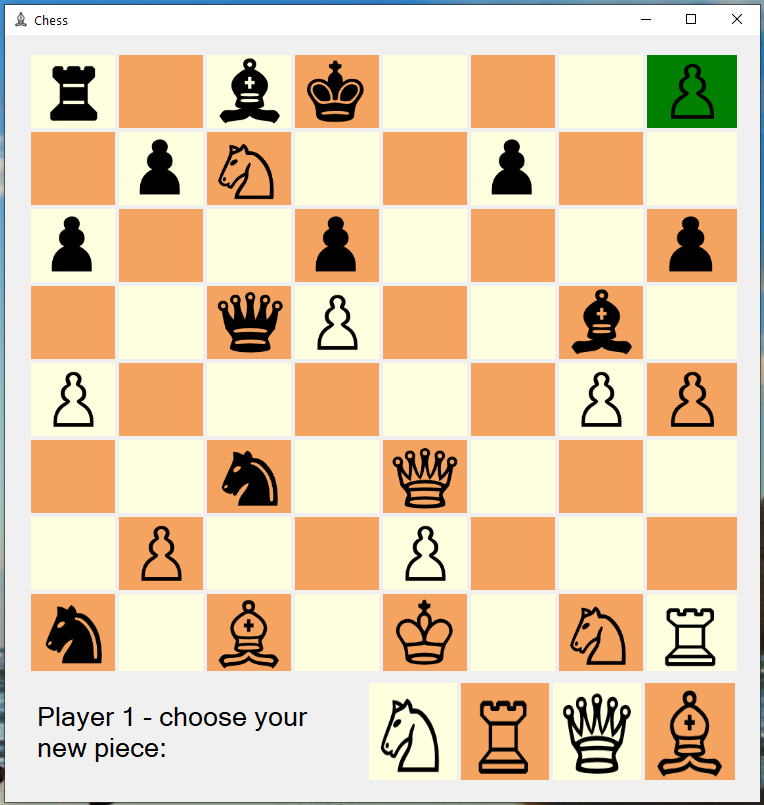

# Windows Forms Chess Application

A two-player desktop chess application created using the Windows Forms library of the .Net Framework

## Table of contents

- [General Information](#general-information)
- [Sample Images](#sample-images)
- [Technologies Used](#technologies-used)
- [Setup](#setup)
- [Features](#features)
- [Current Status](#current-status)
- [Acknowledgements](#acknowledgements)
- [Contact](#contact)

## General information

The aim of this project was to gain experience creating a GUI and using the C# language. Prior to this, the majority of code I have written was abstract and had at most a very basic user interface - examples include writing C++ algorithms on HackerRank and windows console applications. It was a new experience being able to implement features that already existed, rather than building everything up from the most basic level.

The game is drawn using a main TableLayoutPanel containing 64 PictureBox Controls to represent squares on the board, some of which contain a background image of a chess piece. A player clicks on a chess piece, triggering a function that highlights the active piece and also the squares on the grid it can reach. The player can click on the same piece again (or any unhighlighted square) to deactivate the piece. If they click on a highlighted square they will move to that square, unless a function detects it would put their own king in check and prevents the move.

After each move it scans through the opponent's pieces and calculates the number of viable moves (those that are legal and do not cause check). If this reaches zero, CheckMate is declared and the game ends. In keeping with the traditional game, there is also a function to promote a pawn if it reaches the opposing end of the board - this is implemented using a separate TableLayoutPanel presenting the pieces they can choose from.

## Sample Images

#### An active piece with possible moves displayed:

#### Player alerted that the move they attempted puts their own king in check:

#### Pawn reaches the end and activates the promotion menu

## Technologies Used

- C#
- Windows Forms
- .NET Framework

## Setup

To play the game, please download the 'WinForms Chess.exe' file in the top level of this repository. Please note that this game has not been adapted to work on operating systems other than Microsoft Windows.

## Code Example

#### The following function is called using an object (called currentMove) that describes the details of the selected chesspiece. It calls on subfunctions that highlight possible moves that the active piece can make - these return a bool that allows the function to decide whether to keep checking in the same direction or not (eg. when a piece such as a rook can move more than one square at a time if it has not met another chess piece):

    private void findReachableSquares(pictureBoxInformation currentMove)
    {
        switch (currentMove.pieceType)  //the possible moves depend on the piece type
        {
            case "Pawn":                                        //the most awkward type
                if (currentMove.pieceColor == "w")              //movement dependent on color (unlike other pieces)
                {                                               //first test for vertical only moves
                    if (canItMoveHere(0, -1, currentMove))      //canItMoveHere highlights only the cells we can move to based on the supplied movement vector arguments
                    {                                           //It returns true if the move is viable, otherwise false
                        if (currentMove.startRow == 6)          //edge case where pawn is in start row and may be able to move 2 units
                        {
                            canItMoveHere(0, -2, currentMove);
                        }
                    }
                    canItMoveHere(-1, -1, currentMove);         //now test for diagonal attack moves
                    canItMoveHere(1, -1, currentMove);          //^
                }
                else                                            //alternate situation where the tag of the active control begins with 'b' - it is a black piece
                {
                    if (canItMoveHere(0, 1, currentMove))
                    {
                        if (currentMove.startRow == 1)
                        {
                            canItMoveHere(0, 2, currentMove);
                        }
                    }
                    canItMoveHere(-1, 1, currentMove);
                    canItMoveHere(1, 1, currentMove);
                }
                break;
            case "Knight":
                for (int i = 0; i < 8; i++)                     //iterate through the global knightRowVector & knightColumnVector arrays to get the dy and dx values
                {
                    canItMoveHere(knightRowVector[i], knightColumnVector[i], currentMove);
                }
                break;
            case "Rook":
                testOrthogonal(currentMove);                    //a subfuction that handles vertical only and horizontal only moves
                break;
            case "Bishop":
                testDiagonal(currentMove);                      //a subfuction that handles moves that are both vertical and horizontal
                break;
            case "Queen":
                testOrthogonal(currentMove);
                testDiagonal(currentMove);
                break;
            case "King":
                testOrthogonal(currentMove);
                testDiagonal(currentMove);
                break;
        }
    }

#### ...channeling the flow of information through different paths within the same functions significantly reduced the amount of code needed; otherwise it would have been neccesary to write many separate but similar functions for different types of chess piece.

## Features

Some things I like about the project:

- Limiting user interaction to simple click events on the controls reduces the need for extra checks as invalid inputs cannot be made.
- The function that checks if a King is currently in check works outwards from that King (rather than by checking the moves of every single opponent piece). It checks that (for example) there is no bishop in diagonol line of sight of the king. This is not really neccesary from a performance point of view, but part of the use of the project was to practice implementing performant solutions.

Some possible improvements:

- There are some other standard chess moves and rules (such as castling, en passant capture) that have not been implemented as they do not further my learning goals.
- An online or local network version would be useful as an exercise in developing a game over a network

## Current Status

The project in its current functional (but unpolished) state can be downloaded. There are no further plans to improve it.

## Acknowledgements

The images of chess pieces used in the project (for the PictureBox Controls and the .icon file) are downloaded from https://www.clipartmax.com on a personal use basis.

## Contact

For more information, please contact [@JakeMatthewsUK](https://www.jakematthews.uk/).
